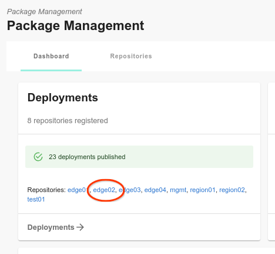
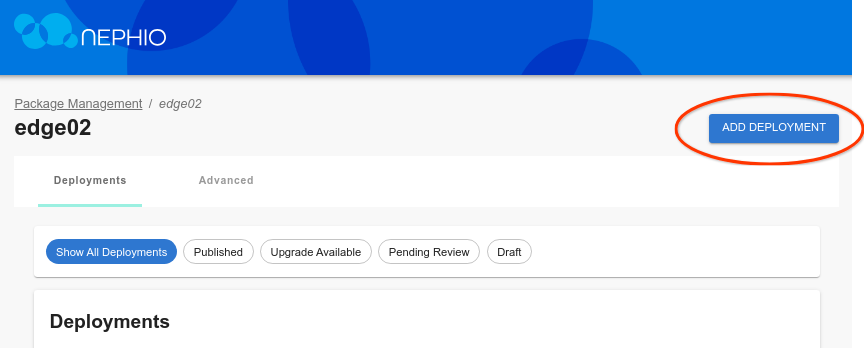
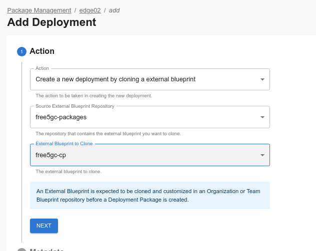

# Quick Start for GCE

1. Create a VM:

   ```bash
   $ gcloud compute instances create --machine-type e2-standard-8 \
                                     --boot-disk-size 200GB \
                                     --image-family=ubuntu-2004-lts \
                                     --image-project=ubuntu-os-cloud \
                                     --metadata=startup-script-url=https://raw.githubusercontent.com/nephio-project/test-infra/main/e2e/provision/gce_init.sh \
                                     nephio-r1-e2e
   ```

   There are some optional metadata values you can pass (add them as
   comma-delimited key=value pairs in the `--metadata` flag).

   - `nephio-run-e2e` defaults to `false` but you can set it to `true` to run
     the full e2e suite, instead of just setting up the sandbox.
   - `nephio-setup-type` defaults to `r1` but `one-summit` will use the workshop
     code instead of the R1 code. Results are not guaranteed with that.
   - `nephio-setup-debug` defaults to `false` but `true` will turn on verbose
     debugging.
   - `nephio-test-infra-repo` defaults to
     `https://github.com/nephio-project/test-infra.git` but you can set it to
     your repository when testing changes to these scripts, and your repo will
     then be pulled by the `gce_init.sh` instead.
   - `nephio-test-infra-branch` defaults to `main` but you can use it along with
     the repo value to choose a branch in the repo for testing.

2. If you want to watch the progress of the installation, give it about 30
   seconds to reach a network accessible state, and then ssh in and tail the
   startup script exection:

   Googlers (you also need to run `gcert`):
   ```bash
   $ gcloud compute ssh ubuntu@nephio-r1-e2e -- \
                    -o ProxyCommand='corp-ssh-helper %h %p' \
                    sudo journalctl -u google-startup-scripts.service --follow
   ```

   Everyone else:
   ```bash
   $ gcloud compute ssh ubuntu@nephio-r1-e2e -- \
                    sudo journalctl -u google-startup-scripts.service --follow
   ```

4. Once it's done, ssh in and port forward the port to the UI (7007) and to
   Gitea's HTTP interface, if you want to have that (3000):

   Googlers (you also need to run `gcert`):
   ```bash
   $ gcloud compute ssh ubuntu@nephio-r1-e2e -- \
                    -o ProxyCommand='corp-ssh-helper %h %p' \
                    -L 7007:localhost:7007 \
                    -L 3000:172.18.0.200:3000 \
                    kubectl port-forward --namespace=nephio-webui svc/nephio-webui 7007
   ```

   Everyone else:
   ```bash
   $ gcloud compute ssh ubuntu@nephio-r1-e2e -- \
                    -L 7007:localhost:7007 \
                    -L 3000:172.18.0.200:3000 \
                    kubectl port-forward --namespace=nephio-webui svc/nephio-webui 7007
   ```

   You can now navigate to
   [http://localhost:7007/config-as-data](http://localhost:7007/config-as-data) to
   browse the UI.

5. You probably want a second ssh window open to run `kubectl` commands, etc.,
without the port forwarding (which would fail if you try to open a second ssh
connection with that setting).

   Googlers:
   ```bash
   $ gcloud compute ssh ubuntu@nephio-r1-e2e -- -o ProxyCommand='corp-ssh-helper %h %p'
   ```

   Everyone else:
   ```bash
   $ gcloud compute ssh ubuntu@nephio-r1-e2e
   ```

6. Our e2e topology consists of one regional cluster, and three edge clusters.
   Let's start by deploying the regional cluster. In this case, we will use
   manual kpt commands to deploy a single cluster. First, check to make sure
   that both the mgmt and mgmt-staging repositories are in the Ready state.
   The mgmt repository is used to manage the contents of the management
   cluster via Nephio; the mgmt-staging repository is just used internally
   during the cluster bootstrapping process.

   Use the session just started on the VM to run these commands:

   ```
   $ kubectl get repositories
   NAME                      TYPE   CONTENT   DEPLOYMENT   READY   ADDRESS
   free5gc-packages          git    Package   false        True    https://github.com/nephio-project/free5gc-packages.git
   mgmt                      git    Package   true         True    http://172.18.0.200:3000/nephio/mgmt.git
   mgmt-staging              git    Package   false        True    http://172.18.0.200:3000/nephio/mgmt-staging.git
   nephio-example-packages   git    Package   false        True    https://github.com/nephio-project/nephio-example-packages.git
   ```

   Since those are Ready, we can deploy a package from the
   nephio-example-packages repository into the mgmt repository. To do this, we
   retrieve the Package Revision name using `kpt alpha rpkg get`, and then clone
   that specific Package Revision via the `kpt alpha rpkg clone` command,
   propose and approve the resulting package revision. We want to use the latest
   revision of the nephio-workload-cluster package, which you can get with the
   command below (your latest revision may be different):

   ```
   $ kpt alpha rpkg get --name nephio-workload-cluster
   NAME                                                               PACKAGE                   WORKSPACENAME   REVISION   LATEST   LIFECYCLE   REPOSITORY
   nephio-example-packages-05707c7acfb59988daaefd85e3f5c299504c2da1   nephio-workload-cluster   main            main       false    Published   nephio-example-packages
   nephio-example-packages-781e1c17d63eed5634db7b93307e1dad75a92bce   nephio-workload-cluster   v1              v1         false    Published   nephio-example-packages
   nephio-example-packages-5929727104f2c62a2cb7ad805dabd95d92bf727e   nephio-workload-cluster   v2              v2         false    Published   nephio-example-packages
   nephio-example-packages-cdc6d453ae3e1bd0b64234d51d575e4a30980a77   nephio-workload-cluster   v3              v3         false    Published   nephio-example-packages
   nephio-example-packages-c78ecc6bedc8bf68185f28a998718eed8432dc3b   nephio-workload-cluster   v4              v4         false    Published   nephio-example-packages
   nephio-example-packages-46b923a6bbd09c2ab7aa86c9853a96cbd38d1ed7   nephio-workload-cluster   v5              v5         false    Published   nephio-example-packages
   nephio-example-packages-17bffe318ac068f5f9ef22d44f08053e948a3683   nephio-workload-cluster   v6              v6         false    Published   nephio-example-packages
   nephio-example-packages-0fbaccf6c5e75a3eff7976a523bb4f42bb0118ce   nephio-workload-cluster   v7              v7         true     Published   nephio-example-packages
   ```

   Then, use the NAME from that in the `clone` operation, and the resulting
   PackageRevision name to perform the `propose` and `approve` operations:

   ```
   $ kpt alpha rpkg clone -n default nephio-example-packages-0fbaccf6c5e75a3eff7976a523bb4f42bb0118ce --repository mgmt regional
   mgmt-08c26219f9879acdefed3469f8c3cf89d5db3868 created
   $ kpt alpha rpkg propose -n default mgmt-08c26219f9879acdefed3469f8c3cf89d5db3868
   mgmt-08c26219f9879acdefed3469f8c3cf89d5db3868 proposed
   $ kpt alpha rpkg approve -n default mgmt-08c26219f9879acdefed3469f8c3cf89d5db3868
   mgmt-08c26219f9879acdefed3469f8c3cf89d5db3868 approved
   ```

   ConfigSync running in the management cluster will now pull out this new
   package, creating all the resources necessary to provision a Kind cluster and
   register it with Nephio. This will take about five minutes or so.

7. You can check if the cluster is up with `kubectl get clusters`:

   ```
   $ kubectl get clusters
   NAME       PHASE         AGE     VERSION
   regional   Provisioned   52m     v1.26.3
   ```

   We will want to be able to access the API server of that cluster as well, so
   we will need to get the `kubeconfig` file for it. To retrieve the file, we
   pull it from the Kubernetes Secret, and decode the Base64 encoding:

   ```
   $ kubectl get secret regional-kubeconfig -o jsonpath='{.data.value}' | base64 -d > regional-kubeconfig
   ```

   We can then use it to access the workload cluster directly:

   $ kubectl --kubeconfig regional-kubeconfig get ns
   NAME                           STATUS   AGE
   config-management-monitoring   Active   3h35m
   config-management-system       Active   3h35m
   default                        Active   3h39m
   kube-node-lease                Active   3h39m
   kube-public                    Active   3h39m
   kube-system                    Active   3h39m
   $
   ```

   You should also check that the Kind cluster came up fully with `kubectl get
   machinesets`. You should see READY and AVAILABLE replicas.

   ```
   $ kubectl get machinesets
   NAME                                   CLUSTER    REPLICAS   READY   AVAILABLE   AGE     VERSION
   regional-md-0-zhw2j-58d497c498xkz96z   regional   3          3       3           3h58m   v1.26.3
   ```

8. Next, you can deploy a fleet of three edge clusters by applying the
   PackageVariantSet that can be found in the `tests` directory:

   ```
   $ kubectl apply -f test-infra/e2e/tests/002-edge-clusters.yaml
   ```

   This is equivalent to doing the same `kpt` commands we did for the regional
   cluster, except that it uses the PackageVariantSet controller, which is
   running in the Nephio management cluster to do them automatically. It will
   clone the package for each entry in the field `packageNames` in the
   PackageVariantSet. You can observe the progress by looking at the UI, or by
   using `kubectl` to monitor the various package variants, package revisions,
   and kind clusters that get created.

9. While the edge clusters are deploying (which will take 5-10 minutes), we can
   install the free5gc functions that are not managed by the operator. For this,
   we will use the regional cluster. Since these are all installed with a single
   package, we can use the UI to pick the `free5gc-cp` package from the
   `free5gc-packages` repository, and clone it to the `regional` repository (we
   could have also used the CLI).

   

   

   

   Click through the "Next" button until you are through all the steps, then
   click "Add Deployment". On the next screen, click "Propose", and then
   "Approve". Shortly thereafter, we should it in the cluster:

   ```
   $ kubectl --kubeconfig regional-kubeconfig get ns
   NAME                           STATUS   AGE
   config-management-monitoring   Active   4h8m
   config-management-system       Active   4h8m
   default                        Active   4h8m
   free5gc-cp                     Active   7s
   kube-node-lease                Active   4h8m
   kube-public                    Active   4h8m
   kube-system                    Active   4h8m
   resource-group-system          Active   4h7m
   $
   $ kubectl --kubeconfig regional-kubeconfig -n free5gc-cp get all
   NAME                                 READY   STATUS     RESTARTS   AGE
   pod/free5gc-ausf-7d494d668d-nswlf    0/1     Init:0/1   0          18s
   pod/free5gc-nrf-66cc98cfc5-8scpn     0/1     Init:0/1   0          18s
   pod/free5gc-nssf-668db85d54-jhqlc    0/1     Init:0/1   0          18s
   pod/free5gc-pcf-55d4bfd648-584tp     0/1     Init:0/1   0          18s
   pod/free5gc-udm-845db6c9c8-jmwrl     0/1     Init:0/1   0          18s
   pod/free5gc-udr-79466f7f86-mw6bz     0/1     Init:0/1   0          17s
   pod/free5gc-webui-84ff8c456c-bkvhm   0/1     Init:0/1   0          17s
   pod/mongodb-0                        0/1     Pending    0          17s

   NAME                    TYPE        CLUSTER-IP       EXTERNAL-IP   PORT(S)          AGE
   service/ausf-nausf      ClusterIP   10.134.77.186    <none>        80/TCP           18s
   service/mongodb         ClusterIP   10.141.173.153   <none>        27017/TCP        18s
   service/nrf-nnrf        ClusterIP   10.130.158.206   <none>        8000/TCP         18s
   service/nssf-nnssf      ClusterIP   10.128.206.40    <none>        80/TCP           18s
   service/pcf-npcf        ClusterIP   10.130.21.1      <none>        80/TCP           18s
   service/udm-nudm        ClusterIP   10.136.45.206    <none>        80/TCP           18s
   service/udr-nudr        ClusterIP   10.134.52.158    <none>        80/TCP           18s
   service/webui-service   NodePort    10.136.16.33     <none>        5000:30500/TCP   18s

   NAME                            READY   UP-TO-DATE   AVAILABLE   AGE
   deployment.apps/free5gc-ausf    0/1     1            0           18s
   deployment.apps/free5gc-nrf     0/1     1            0           18s
   deployment.apps/free5gc-nssf    0/1     1            0           18s
   deployment.apps/free5gc-pcf     0/1     1            0           18s
   deployment.apps/free5gc-udm     0/1     1            0           18s
   deployment.apps/free5gc-udr     0/1     1            0           18s
   deployment.apps/free5gc-webui   0/1     1            0           17s

   NAME                                       DESIRED   CURRENT   READY   AGE
   replicaset.apps/free5gc-ausf-7d494d668d    1         1         0       18s
   replicaset.apps/free5gc-nrf-66cc98cfc5     1         1         0       18s
   replicaset.apps/free5gc-nssf-668db85d54    1         1         0       18s
   replicaset.apps/free5gc-pcf-55d4bfd648     1         1         0       18s
   replicaset.apps/free5gc-udm-845db6c9c8     1         1         0       18s
   replicaset.apps/free5gc-udr-79466f7f86     1         1         0       18s
   replicaset.apps/free5gc-webui-84ff8c456c   1         1         0       17s

   NAME                       READY   AGE
   statefulset.apps/mongodb   0/1     17s
   ```

10. Now we need to deploy the free5gc operator across all of the workload
    clusters (regional and edge). To do this, we use another PackageVariantSet.
    This one uses an objectSelector, and selects the WorkloadCluster resources
    that were added to the management cluster when we deployed the
    nephio-workload-cluster packages (manually as well as via
    PackageVariantSet).

    ```
    $ kubectl apply -f test-infra/e2e/tests/004-free5gc-operator.yaml
    ```

11. Within five minutes of applying that, you should see `free5gc` namespaces on
    your regional and edge clusters:

    ```
    $ kubectl --kubeconfig edge01-kubeconfig get ns
    NAME                           STATUS   AGE
    config-management-monitoring   Active   3h46m
    config-management-system       Active   3h46m
    default                        Active   3h47m
    free5gc                        Active   159m
    kube-node-lease                Active   3h47m
    kube-public                    Active   3h47m
    kube-system                    Active   3h47m
    resource-group-system          Active   3h45m
    $
    $ kubectl --kubeconfig edge01-kubeconfig -n free5gc get all
    NAME                                                          READY   STATUS    RESTARTS   AGE
    pod/free5gc-operator-controller-controller-58df9975f4-sglj6   2/2     Running   0          164m

    NAME                                                     READY   UP-TO-DATE   AVAILABLE   AGE
    deployment.apps/free5gc-operator-controller-controller   1/1     1            1           164m

    NAME                                                                DESIRED   CURRENT   READY   AGE
    replicaset.apps/free5gc-operator-controller-controller-58df9975f4   1         1         1       164m
    ```

12. Finally, we can deploy individual network functions which the operator will
    instantiate. For now, we will use individual PackageVariants targeting the regional
    cluster for each of the AMF and SMF, and a PackageVariantSet targeting the
    edge clusters for the UPFs. In the future, we could put all of these
    resources into yet-another-package - a "topology" package - and deploy them all as a
    unit. Or we can use a topology controller to create them. But for now, let's do each
    manually.

    ```
    $ kubectl apply -f test-infra/e2e/tests/005-regional-free5gc-amf.yaml
    $ kubectl apply -f test-infra/e2e/tests/005-regional-free5gc-smf.yaml
    $ kubectl apply -f test-infra/e2e/tests/006-edge-free5gc-upf.yaml
    ```
