# Bootstrap

This role installs and configures the tool set required to deploy a Nephio Management cluster.

## Requirements

* [Docker Container Engine](https://docs.docker.com/engine/install/). Recommended Ansible role: `andrewrothstein.docker_engine`
* [KinD CLI](https://kind.sigs.k8s.io/docs/user/quick-start/#installation). Recommended Ansible role: `andrewrothstein.kind`
* [kpt CLI](https://kpt.dev/installation/kpt-cli). Recommended Ansible role: `andrewrothstein.kpt`

## Role Variables

Available variables are listed below, along with default values (see defaults/main.yml):

| Variable                        | Required | Default                                                       | Choices                   | Comments                                                                          |
|---------------------------------|----------|---------------------------------------------------------------|---------------------------|-----------------------------------------------------------------------------------|
| host_reqs.sanbox.vcpu           | no       | 6                                                             |                           | Minimum vCPUs required for Sandbox installation                                   |
| host_reqs.sanbox.memory         | no       | 6                                                             |                           | Minimum RAM required (GB ) for Sandbox installation                               |
| host_reqs.end_to_end.vcpu       | no       | 16                                                            |                           | Minimum vCPUs required for executing End-to-End testing                           |
| host_reqs.end_to_end.memory     | no       | 32                                                            |                           | Minimum RAM required (GB ) for executing End-to-End testing                       |
| container_engine                | no       | docker                                                        | docker                    | Container engine utilized for the management cluster creation                     |
| gtp5g_dest                      | no       | /opt/gtp5g                                                    |                           | Destination path for GTP5G source code                                            |
| gtp5g_version                   | no       | v0.6.8                                                        |                           | GTP5G source code version                                                         |
| gtp5g_tarball_url               | no       |                                                               |                           | GTP5G tarball URI                                                                 |
| k8s.context                     | no       | kind-kind                                                     |                           | Kubernetes context to create gitea resources                                      |
| k8s.version                     | no       | v1.29.2                                                       |                           | Kubernetes version used for the management cluster                                |
| kind.enabled                    | no       | true                                                          | true, false               | Enable/Disable Kubernetes Cluster creation                                        |
| nephio_catalog_repo_uri         | no       | https://github.com/nephio-project/catalog.git                 |                           | Default kpt catalog packages repository                                           |
| gitea.enabled                   | no       | true                                                          | true, false               | Enable/Disable gitea services                                                     |
| gitea.k8s.namespace             | no       | gitea                                                         |                           | Kubernetes namespace for gitea resources                                          |
| gitea.k8s.postgres_password     | no       | c2VjcmV0                                                      |                           | `postgres-password` secret value for gitea database service                       |
| gitea.k8s.db_password           | no       | c2VjcmV0                                                      |                           | `password` secret value for gitea service                                         |
| gitea.k8s.username              | no       | nephio                                                        |                           | Gitea admin user name                                                             |
| gitea.k8s.password              | no       | secret                                                        |                           | Gitea admin password                                                              |
| gitea.k8s.namespaces            | no       |                                                               |                           | List of Kubernetes namespaces to watch for gitea deployment rersources            |
| gitea.kpt.packages              | no       |                                                               |                           | List of gitea kpt packages                                                        |
| resource_backend.enabled        | no       | true                                                          | true, false               | Enable/Disable resource-backend services                                          |
| resource_backend.k8s.namespaces | no       |                                                               |                           | List of Kubernetes namespaces to watch for resource-backend deployment rersources |
| resource_backend.kpt.packages   | no       |                                                               |                           | List of resource-backend kpt packages                                             |
| cert_manager.enabled            | no       | true                                                          | true, false               | Enable/Disable cert-manager services                                              |
| cert_manager.k8s.namespaces     | no       |                                                               |                           | List of Kubernetes namespaces to watch for cert-manager deployment rersources     |
| cert_manager.kpt.packages       | no       |                                                               |                           | List of cert-manager kpt packages                                                 |
| cluster_api.enabled             | no       | true                                                          | true, false               | Enable/Disable cluster-api services                                               |
| cluster_api.k8s.namespaces      | no       |                                                               |                           | List of Kubernetes namespaces to watch for cluster-api deployment rersources      |
| cluster_api.kpt.packages        | no       |                                                               |                           | List of cluster-api kpt packages                                                  |
| metallb.enabled                 | no       | true                                                          | true, false               | Enable/Disable MetalLB services                                                   |
| metallb.k8s.namespaces          | no       |                                                               |                           | List of Kubernetes namespaces to watch for MetalLB deployment rersources          |
| metallb.kpt.packages            | no       |                                                               |                           | List of MetalLB kpt packages                                                      |

## Dependencies

The `install` Ansible role depends on the outcome generated by this role.

## Example Playbook

```yaml
- hosts: all
  pre_tasks:
    - name: Update Apt cache
      ansible.builtin.raw: apt-get update --allow-releaseinfo-change
      become: true
      changed_when: false
    - name: Install pip package
      become: true
      ansible.builtin.package:
        name: python3-pip
        state: present
      when: ansible_distribution == 'Ubuntu'
    - name: Install kubernetes python package
      become: true
      ansible.builtin.pip:
        name: kubernetes==26.1.0
    - name: Unarchive /tmp/kpt.tgz into /usr/local/bin/
      become: true
      become_user: root
      ansible.builtin.unarchive:
        remote_src: true
        src: https://github.com/GoogleContainerTools/kpt/releases/download/v1.0.0-beta.49/kpt_linux_amd64-1.0.0-beta.49.tar.gz
        dest: /usr/local/bin/
        creates: /usr/local/bin/kpt
    - name: Install KinD command-line
      ansible.builtin.include_role:
        name: andrewrothstein.kind
    - name: Install Docker Engine
      become: true
      ansible.builtin.include_role:
        name: andrewrothstein.docker_engine
  roles:
    - bootstrap
```

## Workflow

```mermaid
flowchart TD
    A[main.yml] -->|Check Host requirements| B(Checking host has minimum number of CPUS)
    B --> C(Checking host has minimum RAM)
    C --> D(Checking host has minimal kernel version)
    D -->|Load gtp5g kernel module| E(Load OS specific variables)
    E --> F(Install compilation packages and kernel development tools on Debian/RedHat)
    F --> G{ansible_os_family == 'Debian/RedHat'?}
    G -- true --> H(Install Debian kernel development tools)
    H --> I(Install Debian/RedHat kernel development tools) --> J
    G -- false --> J(Get gtp5g module information)
    J --> K(Create gtp5g destination folder)
    K --> L(Extract gtp5g driver source code)
    L --> M{"ERROR: Module gtp5g not found." in bootstrap_modinfo_gtp5g.stderr?}
    M -- true --> N(Configure gtp5g module)
    N --> O(Install gtp5g module)
    M -- false --> P1
    O -->|Load sctp kernel module| P1(install kernel-modules-extra)
    P1 --> P2(load the sctp module)
    P2 --> P(Force all notified handlers to run at this point)
    P -->|Create Management KinD Cluster| Q{kind.enbled?}
    Q -- true --> R(Get k8s clusters)
    R --> S{not 'kind' in bootstrap_kind_get_cluster.stdout?}
    S -- true --> T(Create management cluster)
    S -- false --> U
    T --> U(Create .kube directory)
    U --> V(Copy root kubeconfig file)
    V --> W(Wait for Kind Nodes to become ready)
    Q -- false --> Y
    W -->|Create Gitea K8s resources| Y(Create gitea namespace)
    Y --> Z(Create gitea postgresql user password)
    Z --> AA(Create gitea user password)
    AA -->|Apply kpt packages| AB(Init job ids array)
    AB --> AC(Create list of packages)
    AC --> AD(Deploy base packages)
    AD --> AE(Wait for packages to be applied)
    AE --> AF(Create list of namespaces)
    AF --> |Wait for deployments| AG(Get deployment resources)
    AG --> AH(Wait for deployments)
```


