# Bootstrap

This role installs and configures the tool set required to deploy a Nephio Management cluster.

## Requirements

* [Docker Container Engine](https://docs.docker.com/engine/install/). Recommended Ansible role: `andrewrothstein.docker_engine`
* [KinD CLI](https://kind.sigs.k8s.io/docs/user/quick-start/#installation). Recommended Ansible role: `andrewrothstein.kind`
* [kpt CLI](https://kpt.dev/installation/kpt-cli). Recommended Ansible role: `andrewrothstein.kpt`

## Role Variables

Available variables are listed below, along with default values (see defaults/main.yml):

| Variable                 | Required | Default    | Choices                   | Comments                                                      |
|--------------------------|----------|------------|---------------------------|---------------------------------------------------------------|
| host_min_vcpu            | no       | 8          |                           | Minimum vCPUs required                                        |
| host_min_cpu_ram         | no       | 16         |                           | Minimum RAM required (GB)                                     |
| host_min_root_disk_space | no       | 50         |                           | Minimum disk space required (GB)                              |
| container_engine         | no       | docker     | docker                    | Container engine utilized for the management cluster creation |
| kubernetes_version       | no       | v1.27.1    |                           | Kubernetes version used for the management cluster            |
| gitea_postgres_password  | no       | c2VjcmV0   |                           | `postgres-password` secret value for gitea database service   |
| gitea_db_password        | no       | c2VjcmV0   |                           | `password` secret value for gitea service                     |
| gitea_username           | no       | nephio     |                           | Gitea admin user name                                         |
| gitea_password           | no       | secret     |                           | Gitea admin password                                          |
| gtp5g_dest               | no       | /opt/gtp5g |                           | Destination path for GTP5G source code                        |
| gtp5g_version            | no       | v0.6.8     |                           | GTP5G source code version                                     |
| gtp5g_tarball_url        | no       |            |                           | GTP5G tarball URI                                             |

## Dependencies

The `install` Ansible role depends on the outcome generated by this role.

## Example Playbook

```yaml
    - hosts: all
      roles:
         - bootstrap
```

## Workflow

```mermaid
flowchart TD
    A[main.yml] -->|Check Host requirements| B(Checking host has minimum number of CPUS)
    B --> C(Checking host has minimum RAM)
    C --> D(Checking host has minimal kernel version)
    D -->|Load gtp5g kernel module| E(Load OS specific variables)
    E --> F(Install compilation packages)
    F --> G{ansible_os_family == 'Debian/RedHat'?}
    G -- true --> H(Install Debian kernel development tools)
    H --> I(Install Debian/RedHat kernel development tools) --> J
    G -- false --> J(Get gtp5g module information)
    J --> K(Create gtp5g destination folder)
    K --> L(Extract gtp5g driver source code)
    L --> M{"ERROR: Module gtp5g not found." in bootstrap_modinfo_gtp5g.stderr?}
    M -- true --> N(Configure gtp5g module)
    N --> O(Install gtp5g module)
    M -- false --> P
    O -->|Set Kernel Parameters| P(Set kernel parameters)
    P --> Q(Force all notified handlers to run at this point)
    Q --> R(Get k8s clusters)
    R --> S{not 'kind' in bootstrap_kind_get_cluster.stdout?}
    S -- true --> T(Create management cluster)
    S -- false --> U
    T --> U(Create gitea namespace)
    U --> V(Create gitea postgresql user password)
    V --> W(Deploy base packages)
```


