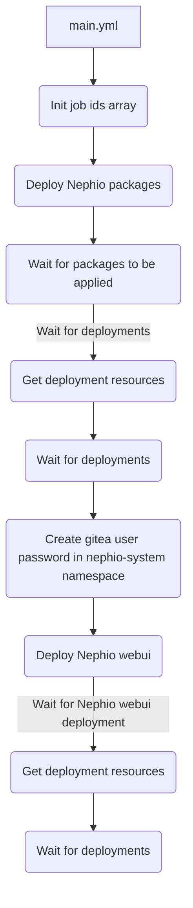

# Install

This role installs Nephio services on a target cluster.

## Requirements

* [Docker Container Engine](https://docs.docker.com/engine/install/). Recommended Ansible role: `andrewrothstein.docker_engine`
* [KinD CLI](https://kind.sigs.k8s.io/docs/user/quick-start/#installation). Recommended Ansible role: `andrewrothstein.kind`
* [kpt CLI](https://kpt.dev/installation/kpt-cli). Recommended Ansible role: `andrewrothstein.kpt`

## Role Variables

Available variables are listed below, along with default values (see defaults/main.yml):

| Variable                   | Required | Default                                                       | Choices | Comments                                                                |
|----------------------------|----------|---------------------------------------------------------------|---------|-------------------------------------------------------------------------|
| k8s.context                | no       | kind-kind                                                     |         | Kubernetes context to create resources                                  |
| gitea.k8s.username         | no       | nephio                                                        |         | Gitea admin user name                                                   |
| gitea.k8s.password         | no       | secret                                                        |         | Gitea admin password                                                    |
| nephio_catalog_repo_uri    | no       | https://github.com/nephio-project/catalog.git                 |         | Default kpt catalog packages repository                                 |
| nephio.k8s.namespaces      | no       |                                                               |         | List of Kubernetes namespaces to watch for  Nephio deployment resources |
| nephio.kpt.packages        | no       |                                                               |         | List of Nephio kpt packages                                             |
| nephio_webui.k8s.namespace | no       | nephio-webui                                                  |         | Kubernetes namespace for Nephio WebUI resources                         |
| nephio_webui.kpt.package   | no       |                                                               |         | Nephio WebUI kpt package details                                        |

## Dependencies

None

## Example Playbook

```yaml
- hosts: all
  pre_tasks:
    - name: Update Apt cache
      ansible.builtin.raw: apt-get update --allow-releaseinfo-change
      become: true
      changed_when: false
    - name: Install pip package
      become: true
      ansible.builtin.package:
        name: python3-pip
        state: present
      when: ansible_distribution == 'Ubuntu'
    - name: Install kubernetes python package
      become: true
      ansible.builtin.pip:
        name: kubernetes==26.1.0
    - name: Unarchive /tmp/kpt.tgz into /usr/local/bin/
      become: true
      become_user: root
      ansible.builtin.unarchive:
        remote_src: true
        src: https://github.com/GoogleContainerTools/kpt/releases/download/v1.0.0-beta.49/kpt_linux_amd64-1.0.0-beta.49.tar.gz
        dest: /usr/local/bin/
        creates: /usr/local/bin/kpt
    - name: Install Docker Engine
      become: true
      ansible.builtin.include_role:
        name: andrewrothstein.docker_engine
    - name: Install KinD command-line
      ansible.builtin.include_role:
        name: andrewrothstein.kind
    - name: Get k8s clusters
      become: true
      ansible.builtin.command: kind get clusters
      register: kind_get_cluster
      failed_when: (kind_get_cluster.rc not in [0, 1])
    - name: Create k8s cluster
      become: true
      ansible.builtin.command: kind create cluster --image kindest/node:v1.27.1
      when: not 'kind' in kind_get_cluster.stdout
  roles:
    - install
```

## Workflow


