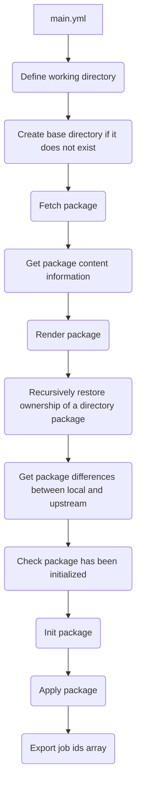

# kpt

This role gets, renders, initialializes and applies a given kpt package.

## Requirements

* [Docker Container Engine](https://docs.docker.com/engine/install/). Recommended Ansible role: `andrewrothstein.docker_engine`
* [kpt CLI](https://kpt.dev/installation/kpt-cli). Recommended Ansible role: `andrewrothstein.kpt`

## Role Variables

Available variables are listed below, along with default values (see defaults/main.yml):

| Variable          | Required | Default | Choices | Comments                                                                            |
|-------------------|----------|---------|---------|-------------------------------------------------------------------------------------|
| reconcile_timeout | no       | 10m     |         | The threshold for how long to wait for all resources to reconcile before giving up. |

## Dependencies

None

## Example Playbook

```yaml
- hosts: all
  pre_tasks:
    - name: Unarchive /tmp/kpt.tgz into /usr/local/bin/
      become: true
      become_user: root
      ansible.builtin.unarchive:
        remote_src: true
        src: https://github.com/GoogleContainerTools/kpt/releases/download/v1.0.0-beta.49/kpt_linux_amd64-1.0.0-beta.49.tar.gz
        dest: /usr/local/bin/
        creates: /usr/local/bin/kpt
    - name: Install Docker Engine
      become: true
      ansible.builtin.include_role:
        name: andrewrothstein.docker_engine
  roles:
    - role: kpt
      vars:
        local_dest_directory: /tmp/kpt-molecule-test/nginx
        pkg: package-examples/nginx
        repo_uri: https://github.com/GoogleContainerTools/kpt
        version: v0.9
        context: kind-kind
        kpt_async: 600
        kpt_poll: 5
```

## Workflow


